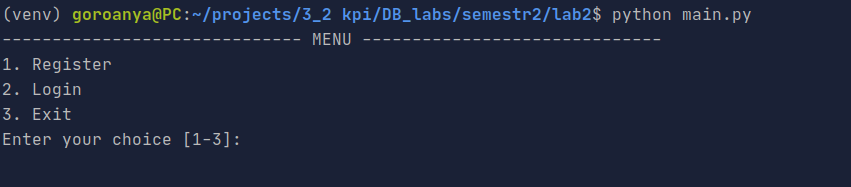
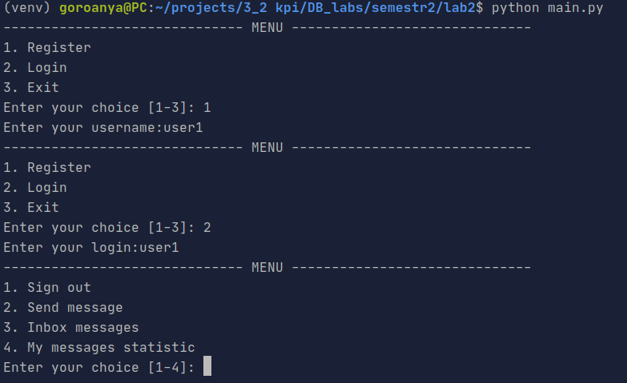
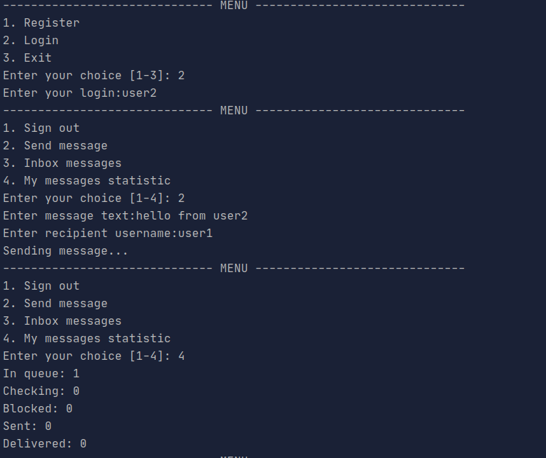
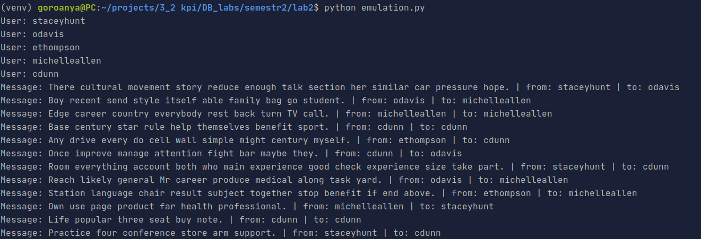
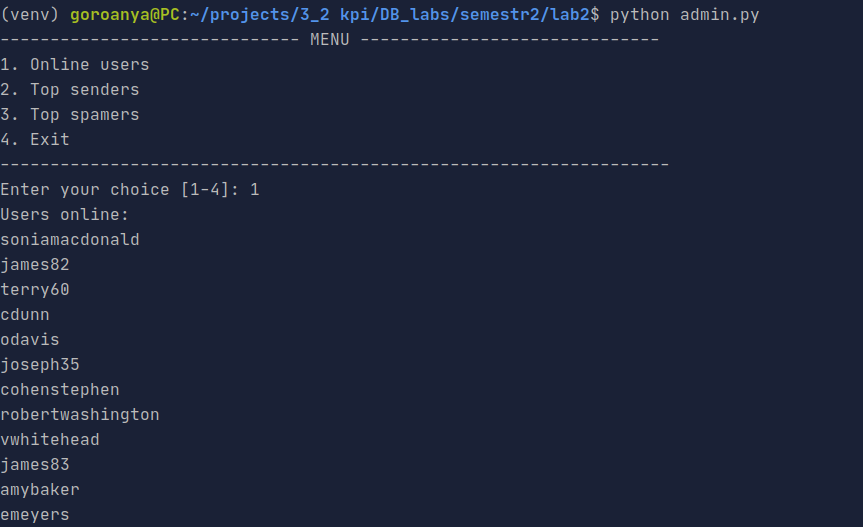
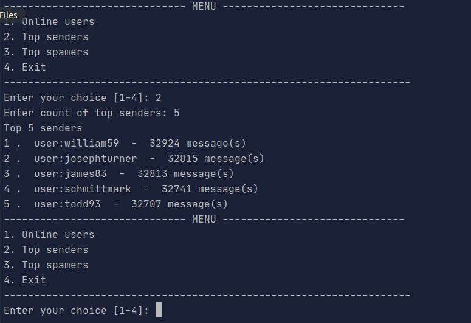

# Лабораторна робота № 2. Практика використання сервера Redis

### Завдання

[Постановка завдання](http://www.scs.kpi.ua/sites/default/files/lab2_bd2-db2019_2020.pdf)

### Запуск
```bash
python -m pip install requirements.txt
python main.py
```
### Приклад роботи програми













